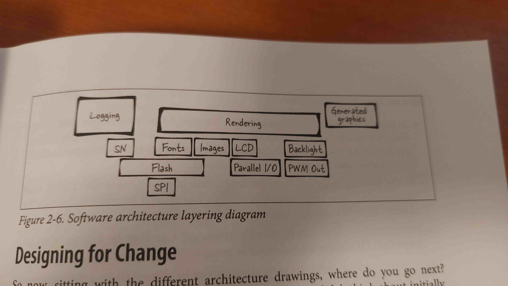

# General notes from reference book readings
See the [project README](../README.md) for more information.

## Chapter 2: Creating a system architecture
### Diagrams
- **Block diagram**: Shows the system as a whole, with each block representing a component or subsystem. Make both a hardware and software block diagram with more or less details

- **Organigram**: Horiz/Vertical-type of block diagram, showing the hierarchy of the system and shared compo. It is useful to show the relationships between the different components

- **Layered diagram**: Shows the system as a stack of layers, with each layer representing a level of abstraction. It is useful to show the different levels of abstraction in the system and each layer's interaction with upper/lower layers based on "touching".

### Design principles
- **Encapsulation**: Hide the internal details of a component and only expose the necessary interfaces. It is useful to protect the component from unwanted access and to make it easier to change the internal implementation without affecting the rest of the system.
We can later refactor if needed without affecting relationships/comms.
- **Delegate**: Delegate the responsibility of a component to another component. It is useful to reduce the complexity of a component and to make it easier to change the implementation of a component without affecting the rest of the system.
- **Driver Interface**:
    - Open (open drivers for use)
    - Close (cleanup resources)
    - Read (reads data from the device)
    - Write (writes data to the device)
    - IOCTL (Everything not covered by rest of interface i.e. custom commands)


Driver == part of the kernel. If no OS, still use Linux-like driver model with kernel interface.
- **Adapter Pattern**: Convert the interface of a component into another interface that the client expects. See example with hardware adaptee and software adapter.


### Essential interfaces
#### Logging interface
Design based on the requirements of the system. It is useful to have a logging interface that can be used to log messages to different destinations (e.g. console, file, network). The interface should be easy to use and flexible enough to support different logging levels (e.g. debug, info, warning, error).

We can modify based on the needs at a given timepoint (e.g. add more logging levels, change the destination of the log messages).

**VERSION CONTROL**:
Should at least have a version check in the logging interface with MAJOR/MINOR/BUILD_INDICATOR with sizeof (1byte/1byte/2byes)

#### Module states
Create a module that can log the state of each module. I.e logging interface has log-levels, logGlobal(on/off) etc.

*Side note: Object-oriented prog in C*
*Private variable outside of funcs*
```c
// Can't be accessed from outside the module
static tBoolean gLogOnPrivate;

// If using a struct
struct {
    tBoolean gLogOnPrivate;
    enum eLogLevel outputLevel[NUM_LOG_SUBSYSTEMS];
} sLogStruct;
static sLogStruct gLogStruct;

// To be created only upon init
struct sLogStruct* LogInit() {
    int i;
    struct sLogStruct *logData = malloc(sizeof(*logData));
    logData->logOn = FALSE;
    for (i = 0; i < NUM_LOG_SUBSYSTEMS; i++) {
        logData->outputLevel[i] = eNoLogging;
    }
    return logData;
}
```
#### Singleton pattern
- Class has only one instance and provides a global point of access to it. 
- Intercepts requests, create objects and preserve solitarity state.
- Access is global, but needs to go through the singleton class.

```cpp
class Singleton {
    private:
        static Singleton*  GetInstance() {
            if (instance == NULL) {
                instance_ = new Singleton;
            }
            return instance_;
        }
    protected:
        Singleton(); // No one creates an instance except the class itself
    private:
    static Singleton* instance_; // The only instance
};

// Define the single instance ptr
Singleton* Singleton::instance_ = NULL;
```
Example: Logging interface can be a singleton class, so that only one instance of the logging interface is created and diff parts can use  it to log messages.

#### Model-View-Controller (MVC) pattern
Separation of concerns between the model (data), view (presentation), and controller (logic).
- **View :** Interface to the user for I/O. User can be a human or another system (e.g. a sensor, hardware, network).
- **Model :** Data and business logic. Raw data + algorithms == something useful.
- **Controller :** Mediator/glue between the view and the model. Handles how to get input from view to model for proc and processed data back to view.


*Complexity of the controller:*
Controller enbales model/view separation by providing services to the view and model (e.g. translate input to an event in the model). Can have different flow patterns (circular, model receives from controller only, translator, model-view no controller). SEE p.35

**Sandbox environment**: Outside of the embedded system, where we can test the system without the need for the hardware. Example to change model algo parameters and see the effect on the view.
Replace the view with a file on external storage, so that we can test the system without the need for the hardware.

-> View can be DAC/ADC, model can be a filter, controller can be a driver that reads the ADC and writes to the DAC.

## Chapter 3: Hardware
### Project flow and design overview
Waterfall style in ideal case because of step dependendies.


#### Hardware design
Hardware team creates a schematic and PCB layout. The schematic is a graphical representation of the components and their connections. All the components on linked to header of processor = BOM (Bill of Materials). The PCB layout is a graphical representation of the physical layout of the components on the PCB which gets assembled into kits.

**Schematic -> PCB layout -> BOM -> Kits/PCBA -> Hardware tests -> Board bringup**

### Reading a datasheet

**Overview:**
API manuals for the peripherals. Contains info on how to use the peripheral, register map, and electrical characteristics. Contains info on how to use the peripheral, register map, and electrical characteristics. READ THE MAIN DESCRIPTION!

#### For harware engineers
**Sections for hardware eng.:**
*TO SKIP*:
absolut max ratings, recommended operating conditions, electrical characteristics, package information, layout and mechanical information.
- **Pinout**: 
Shows the pinout of the device and the functions of each pin. bars == active low (on when voltage low with modifier in front of the signal name)
- **Pin description**:
Description of each pin and its function.
- **Performance characteristics**:
i.e. rated to work in temp range (debugging if periph next to hot component)
- **Sample Schematics**:
~ ee. version for driver code 

#### For software engineers
**Sections for software eng.:**

- theory of information:
Overview of the peripheral and how it works.

- timing diagrams:
Shows the timing of the signals and how they relate to each other. Also shows different modes of operation.


- errata:
Fix comparing to original datasheets.

- Absolute max ratings:
Max ratings for various parameters (e.g. voltage, current, temperature). Exceeding these ratings can damage the device.

**Choice based on the datasheet:**
Iterative process. Look for performance, power, cost, and availability. Filter based on needs of product.

Make a feature summary based on final choice.

#### Processor selection

Documents to look at:
- *User manual*: Lots of details. Read intro. Will share info accross processor families i.e. STM32F10x
- *Dev kit manual:* Setup compiler, debugger, and IDE recommended with documentation. Helps to get started quickly and docs more software oriented.
- *Getting started slides:* Generic overview of the processor. Good for quick overview and processor seleciton
- *Application Notes:* Detailed info on how to use the processor with code examples. Good for specific use cases.
- *wikis/forums:* Community support. 
- *Datasheets:* Detailed info on the processor. More for hardware eng.
- *errata:* errors in the datasheet.

#### Reading a schematic

*Overview*: 
- Shows the components and their connections.
- Look for blocks of textual data == comments from electrical eng.
- Components might not match in terms of numbering. Schematic contains info on how to connect the components together vs not just the layering on the PCB.

Reading order for SE:
1. Processor: usually biggest block in diagram. Look for connections to other components.
2. Memory: SRAM, Flash, EEPROM. Usually 8 address lines and 16 data lines. Some new processor have enough mem to not need external mem.
3. Power: 2 pins for power and ground.
4. Debugging: JTAG/SWD. Look for connections to the processor.
5. Communication: RS232 (serial port), USB/LCD (net labels) 

**Most important non-boxed components:**
- LEDS, switches, buttons
- Resistors (pullups the voltage to a certain level). pullups high when processor isnt driving the line. May have internal pullups for default state
p.63