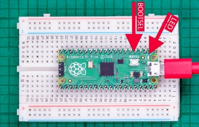
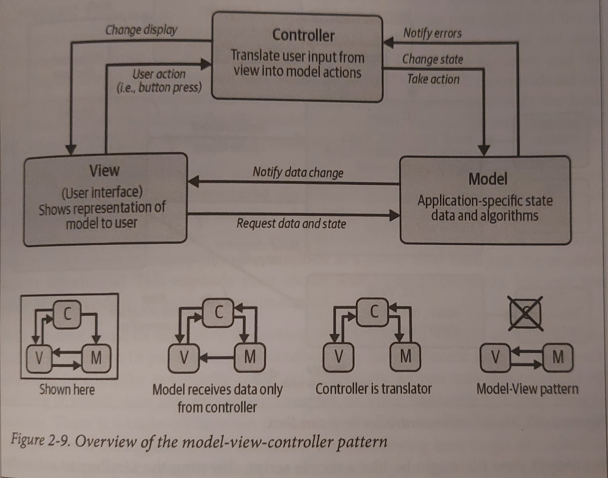

<!-- _paginate: false -->

<h1 style="text-align: center;">Intro to embedded systems and drivers as selected subject</h1> 
<br>
<p style="text-align: center;">DHT22 Temp/humidity and LCD1602 display on Pi Pico W microcontroller</p>

<br>
<p style="text-align: center;">by: <strong>Simon Lalonde</strong></p>
<p style="text-align: center;">For: <strong>IFT-769 </strong> (Theoritical concepts CS)</p>


---

<h2>📖 Project overview (1/2) - <span style="font-weight: normal;">Read 'Making Embedded Systems' by Elecia White</span></h2>

**Making Embedded Systems** 2nd edition by Elecia White 

<u>Book overview</u>:
- **Introduction** to embedded systems architecture and design
- How to work with various **I/O** devices (sensor, display, etc.)
- Learn how to **optimize** and **debug** within resource constraints
- **Advanced** topics like **RTOS**, **networking**, **security**, etc.

<font size="4">White, Elecia. Making Embedded Systems. 2nd ed., O'Reilly Media.</font>

---

<h2> Project overview (2/2) - <span style="font-weight: normal;">Apply the concepts from 1<sup>st</sup> half of reference book</span></h2>

Make a **Temperature** 🌡️ and **humidity** 💧 station with DHT22 sensor and LCD1602 display on Raspberry Pi Pico W microconstroller.

:arrow_right: **Design** a simple embedded system with a microcontroller.
:arrow_right: **Learn** to work with I/O on a microcontroller.
:arrow_right: **Write custom C drivers** for each peripheral.

<u>(Optional goal)</u> 
Take advantage of the Pico W microcropressor's 📡 chip and run a **web server** to **display** the data on a web page via local network.

---

<h2> Project overview (3/3) - <span style="font-weight: normal;">Present and apply relevant concepts from the main reference</span></h2>

<u><strong>Relevant concepts</u></strong> (from the 1<sup>st</sup> half of the book):
- Create **system diagram** and **flowchart** for the project (ch. 2)
- Choosing and understanding **hardware** (ch.3)
- **I/O** and **interrupts** (ch. 4-5)
- Drivers and **communication protocols** (ch. 7)
- **Flow** of activity and **hollistic system** view (ch.6 and 8)

---

<h2> Project goals</h2>

1. **Understand** the basics of embedded systems and drivers.
2. **Learn** to work with I/O devices on a microcontroller.
3. **Write** custom C drivers for each peripheral.
4. **Apply** the concepts from the reference book to the project.
5. **Present** and **apply** relevant concepts from the main reference.

---

<h2> Project timeline - <span style="font-weight: normal;">(1/2)</span></h2>

**Theoritical concepts**
- Read a chapter of the book every week
<br>

**Applied Project**
- Write **System diagram** and **flowchart** for the project
- **Choosing** and **understanding** hardware
- Setup **development environment** and **toolchain**
- Start **writing** the DHT22 driver

--- 
<h2> Project timeline - <span style="font-weight: normal;">End-of-term objectives</span></h2>

**Theoritical concepts**
Continue reading the book past the applied objectives.
<br>

**Applied project**
- **Finish** the DHT22 driver
- **Write** the LCD1602 driver
- **Integrate** the drivers and **test** the system
- (OPTIONAL) Run a **web server** to display the data

---

<h2> What are embedded systems?</h2>

- **Dedicated** computing devices that are part of a larger system. They are designed to perform a specific task or set of tasks.

- Often **resource-constrained** (sometimes < 1Kb of RAM and CPU < 1MHz).

- Need to be **reliable** and operate in **real-time**.

- Some might have **no OS** or a **real-time OS**.

<strong><u>Examples</u></strong>
IoT devices (smart  ), game controllers , medical devices  etc.

---

<h2> Typical hardware components</h2>

<u>**Microcontroller** (CPU, RAM, ROM, I/O)</u>
The **brain** of the system. It executes the program and interacts with the peripherals.

<u>**Peripherals** (I/O devices)</u>
Input and output devices that interact with the environment. Sensors, displays, motors, etc.

<u>**Power supply**</u>
Provides power to the system. Can be a battery, USB, etc.

<u>**Communication interfaces**</u>
Ways to communicate with the system. Serial, I2C, SPI, etc.


---

<h2> Hardware and software design and integration</h2>

**Ideal Workflow:**
1. *Hardware:* SysDesign/Schematics -> Printed Circuit Board (PCB) -> Assembly -> Board bring-up
2. *Software:* Read datasheets -> Write drivers -> Write application code
3. *Integration:* Test and debug -> Optimize -> Repeat
4. *Deployment:* Production -> Maintenance

Both software and hardware/electrical engineers need to work together to design and integrate the system.

<br>
<font size="4">White, Elecia. Making Embedded Systems. 2nd ed., O'Reilly Media.</font>

---

<h2> Weather station project hardware design</h2>

**Weather station** that displays **temperature and humidity** on an **LCD screen** (custom drivers) on a **Raspberry Pi Pico W** microcontroller.

**Components:**
- **Raspberry Pi Pico W microcontroller**: Microcontroller with RP2040 chip and WiFi capabilities
- **DHT22 sensor**: Tempeature and humidity sensor with proprietary protocol (DHT22)
- **LCD1602 display**: Small 2.5" LCD display with I2C communication interface
- Breadboard, jumper wires, resistors, etc.

<font size="3">Adafruit. "DHT22 Temperature-Humidity Sensor." Adafruit Learning System, 2021.</font>
<font size="3">LCD1602 Display. "LCD1602 Display." RoHS, 2021.</font>
<font size="3">Raspberry Pi Foundation. "Raspberry Pi Pico." Raspberry Pi, 2021.</font>

---
<h2> Pico W Microcontroller <span style="font-weight: normal;"> - Datasheet (DS) overview</span></h2>

<u>**Datasheet overview and Pinout** </u>
<div style="display: flex; justify-content: space-between;">
    <div style="width: 50%;">
        <ul>
            <li>RP2040 microcontroller (2MB flash MEM)</li>
            <li>Dual-core ARM Cortex-M0+ processor (133MHz)</li>
            <li>26 GPIO pins (23 digital + 3 ADC)</li>
            <li>Micro USB-B for power and data</li>
            <li>SRAM: 264KB</li>
            <li>2.4GHz WiFi and Bluetooth 5.0</li>
            <li>Comms: SPI, I2C, UART, etc.</li>
        </ul>
    </div>
    
</div>
<font size="3">Raspberry Pi Foundation. "Raspberry Pi Pico-W Datasheet." Raspberry Pi, 2024.</font>

---

<h2> Pico W Microcontroller <span style="font-weight: normal;"> - DS Applications information (1/2) </span></h2>

**Programming the flash**
Reprogram the flash memory with a new program using the USB bootloader.

**GPIO pins and ADC**
- Each pin can be configured as a digital input/output, analog input, or a special function (UART, SPI, I2C, etc.)
- Pins are 3.3V tolerant with 3 of them ADC capable (convert analog to digital)

**USB and power supply**
- Micro USB-B port for power and data (range of 1.8V to 5.5V; can be powered by battery)
- USB bootloader for programming the flash memory

<font size="3">Raspberry Pi Foundation. "Raspberry Pi Pico-W Datasheet." Raspberry Pi, 2024.</font>

---

<h2> Pico W Microcontroller <span style="font-weight: normal;"> - DS Applications information (2/2) </span></h2>

**Wireless interface**
- 2.4GHz WiFi and Bluetooth 5.0 for wireless communication


**Debugging**
- Using the SWD (Serial Wire Debug) interface
- printf to UART0 (default) or USB CDC ACM

<span style="color:red;">***LIMITATIONS***:</span>
- <span style="color:red;">Cannot use CLK and VSYS monitor at the same time</span>
- <span style="color:red;">Cannot check for IRQs when SPI transaction is in progress</span>

<font size="3">Raspberry Pi Foundation. "Raspberry Pi Pico-W Datasheet." Raspberry Pi, 2024.</font>


---

<h2> Setting up the development environment <span style="font-weight: normal;"> - Overview</span></h2>

<u>**Steps**</u>
1. **Download** and **install** the Pico C/C++ SDK from  including submodules
2. Install the **toolchain**: `CMake` and GCC cross compiler `gcc-arm-embedded` (using `nix-shell`)
3. Make a c_cpp_properties.json file for the **VSCode** IDE to recognize SDKs and includes
3. Create a **hello_usb** project by use the SDKs provided libs (configure c/cpp compiler and include in IDE)
4. Compile with the `CMakeLists.txt` and `pico_sdk_import.cmake` scripts. Automated with custom `picow-build.sh` script.
5. **Flash** the program to the Pico W microcontroller using the USB bootloader.

<font size="3">Raspberry Pi Foundation. [pico-sdk](https://github.com/raspberrypi/pico-sdk). GitHub Repository, 2024.</font>

--- 

<h2> Nix shell and bash automation <span style="font-weight: normal;"> (Demo!)</span></h2>

<u>**Nix shell**</u>
- A package manager that allows for reproducible builds.
- Use a `shell.nix` file to specify the dependencies for the project.
- Run a temporary `nix-shell` to enter the environment with the dependencies.

<p style="color:green;">No need for global installations, everything is contained in the `nix-shell`.</p>

<u>**Bash automation**</u>
Automate the docs builds and project builds with bash scripts. Can be used inside the `nix-shell` environment.

<u>**Marp**</u>
A markdown presentation tool that allows for easy slide creation.

---

<h2> Breadboard + Pico W + USB <span style="font-weight: normal;"></span></h2>

<u>**stdio over USB**</u>
A USB Communication Device Class (CDC) ACM virtual serial port, using TinyUSB’s CDC support. We can easily:
- Pass compiled binary (as uf2) to the Pico W which will convert it to a binary file and flash it to the microcontroller.
- Use the USB serial port to send and receive data from the Pico W (standard calls avail. like `printf`)



<font size="3">Raspberry Pi Foundation. "Getting Started with Raspberry Pi Pico." Raspberry Pi, 2024.</font>

---
<h2> Blink onboard LED via Wireless chip's GPIO <span style="font-weight: normal;"></span></h2>


<p style="text-align: center;">DEMO</p>

---
<!-- input and output for helloworld via usb or uart -->
<h2> Input and output via USB and UART <span style="font-weight: normal;">(Hello World!)</span></h2>

**UART:**
- **Universal Asynchronous Receiver-Transmitter** (UART) is a serial communication protocol.
- **TX** (transmit) and **RX** (receive) pins are used to send and receive data.
- **Baud rate** is the speed of communication (bits per second).

**USB:**
- **Universal Serial Bus** (USB) is a common interface for connecting devices.
- **CDC ACM** (Communication Device Class Abstract Control Model) is a USB class for serial communication.

First use <span style="color:blue;">USB</span> to send (binary file) and receive data (`printf`) from the Pico W microcontroller and use `minicom` to listen to data on the <span style="color:green;">serial port.</span>

---
<!-- Explain UART vs USB comms with pico_w.h -->
<h2> IO with Pico W's default GPIO over UART <span style="font-weight: normal;"></span></h2>

Serial input (*stdin*) and output (*stdout*) can be directed to either serial UART or to USB CDC (USB serial). By default, printf target UART0 on Pico.
<br>

| UART0 | Physical Pin | GPIO Pin |
|-------|--------------|----------|
| GND | 3 | N/A |
| UART0_TX (sending from Pico) | 1 | GPIO0 |
| UART0_RX (receiving at Pico) | 2 | GPIO1 |


<font size="5">See the macros in `/pico-sdk/src/boards/include/boards/pico.h` for the default UART pins.</font>

---

<h2> Hello World! <span style="font-weight: normal;">USB output</span></h2>


<p style="text-align: center;">DEMO</p>

```bash
# Compile the hello_usb project
cd hello_usb
./picow-build.sh

# Check for the picow device with dmesg (kernel ring buffer)
sudo dmesg -w

# In a new terminal, flash the compiled binary to the Pico W
cp build/hello_usb.uf2 /run/media/deck/RPI-RP2/

# Open a serial terminal to see the output (using the dmesg output to find the device)
RATE=115200    # The baud rate of the serial port (bits per second)
sudo minicom -D /dev/ttyACM0 -b $RATE

# USE CTL+A then X to exit minicom
```
---

<h2 style="display: block; margin: 0 auto;"> Project <span style="font-weight: normal;"> - To Be Continued</span></h2>

---

<h2>  DHT <span style="font-weight: normal;"> - Overview</span></h2>

---
<!-- USE LATER -->
<h2> Drivers and communication protocols</h2>

**Drivers**
- Software that allows the microcontroller to interact with peripherals.
- They abstract the hardware and provide a simple interface for the application code.

**Communication protocols**
- A set of rules that define how devices communicate with each other.
- Examples: I2C, SPI, UART, etc.


---
<!-- USE LATER -->

<h2> I/O and interrupts</h2>

**Input/Output (I/O)**
- **Input**: Reading data from the environment (sensors, switches, etc.)
- **Output**: Sending data to the environment (displays, motors, etc.)

**Interrupts**
- A way for the microcontroller to respond to events in real-time.
- The microcontroller can stop what it's doing and handle the interrupt.

---

<h2>Model view controller in embedded systems</h2>
<!-- USE LATER -->


<div>
    <p style="float: left; width: 60%; text-align: left;">Often, embedded systems are designed using the <strong>Model-View-Controller</strong> (MVC) pattern. This pattern separates the system into three main components:</p>
    
</div>

- **Model**: The data and logic of the system.
- **View**: The user interface.
- **Controller**: The logic that connects the model and the view. It processes user input and updates the model and view accordingly.

<font size="4">White, Elecia. Making Embedded Systems. 2nd ed., O'Reilly Media.</font>

---

<h2> System diagram</h2>

TODO ADD STATIC FILE

---
